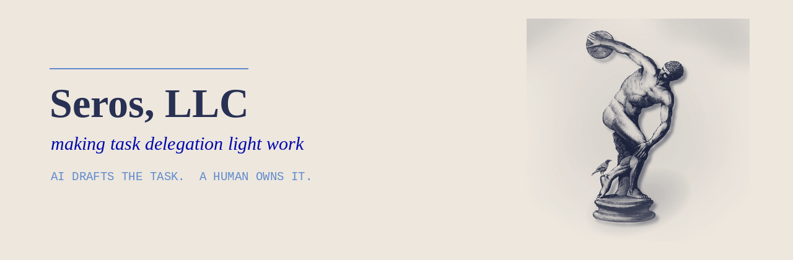

  

  <b>Seros turns scattered requests into clear, assigned, tracked work.</b> 
  AI drafts the task. A human owns it.

  <a href="https://seros.dev">seros.dev</a> &nbsp;·&nbsp;
  <a href="https://seros.dev/privacy.html">Privacy</a> &nbsp;·&nbsp;
  <a href="https://seros.dev/terms.html">Terms</a> &nbsp;·&nbsp;
  <a href="https://seros.dev/security.html">Security</a> &nbsp;·&nbsp;
  <a href="mailto:hello@seros.dev">hello@seros.dev</a>

---

## What we are building

Work rarely stalls on effort. It stalls on hand-off — the request buried in a thread,
the task nobody owns, the context retyped for the third time. Project tools assume the
work is already defined. Defining it is the expensive part.

**Seros captures a request wherever it arrives, drafts the task, proposes an owner, and
tracks it to done.** Outcome, context, acceptance criteria, effort, priority — written
for you, in seconds, and confirmed by a person before anything moves.

| | |
|---|---|
| **Capture** | Connect the places work is asked for: chat, email, tickets, meetings. |
| **Draft** | Turn intent into a well-scoped task with real acceptance criteria. |
| **Assign** | Propose an owner from skills, load, and history — a human confirms. |
| **Track** | Nudges, roll-ups, and a weekly view of what actually moved. |

## Who it is for

Teams of roughly 10–200 that run on hand-offs: agencies and studios, managed service and
IT teams, operations and back-office groups, and founders who are still the bottleneck
for every decision about who does what.

## How we work

- **A human approves every assignment.** We are not building an autopilot for your business.
- **Your content is yours.** We process it to run the service, and model providers do not
  train on it by default. Every subprocessor is named publicly before it is added.
- **No claims we cannot back.** We do not advertise certifications we do not hold, or
  metrics we have not measured.
- **Plain language.** In the product, in the docs, and in the contracts.

## Status

Seros is **pre-launch and in early access**. Repositories here are mostly private while the
first version is built. Public work will appear as it stabilises.

## Contact

| | |
|---|---|
| Early access | [hello@seros.dev](mailto:hello@seros.dev) |
| Security reports | [security@seros.dev](mailto:security@seros.dev) — see [SECURITY.md](../SECURITY.md) |
| Press and partnerships | [hello@seros.dev](mailto:hello@seros.dev) |

© 2026 Seros, LLC. Making task delegation light work.

