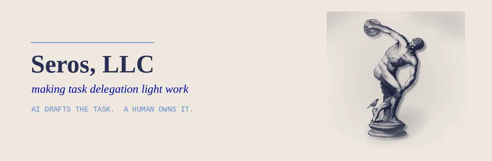

<p align="center">
  
</p>

<p align="center">
  <b>We build the software your business is missing.</b><br>
  Scoped in writing. Built to a fixed scope. Maintained after delivery.
</p>

<p align="center">
  <a href="https://seros.dev">Website</a> ·
  <a href="https://seros.dev/services">Services</a> ·
  <a href="https://seros.dev/work">Work</a> ·
  <a href="https://seros.dev/pricing">Engagements</a> ·
  <a href="https://seros.dev/contact">Start a project</a>
</p>

<p align="center">
  <a href="https://github.com/Seros-LLC/app/actions/workflows/ci.yml"></a>
  <a href="https://github.com/Seros-LLC/website/actions/workflows/site-checks.yml"></a>
  <a href="https://github.com/Seros-LLC/seros/actions/workflows/docs-checks.yml"></a>
</p>

---

## What we do

Most businesses have one process held together by spreadsheets, shared inboxes, and
somebody's memory. It works until it doesn't, and replacing it never reaches the top of
anyone's list.

**Seros, LLC is a solution development company.** We find that process, specify the
replacement in writing, build it to a fixed scope, and hand you the keys.

## How an engagement runs

| Stage | What happens | What you leave with |
|---|---|---|
| **1. Discovery** | A paid discovery sprint. We interview the people doing the work and write down what the system must do. | A written specification you own — yours to build with us or take to anyone else. |
| **2. Build** | Fixed scope, agreed before work starts. No open-ended hourly drift. | The working system, its source, and its tests. |
| **3. Handover** | Code, infrastructure and accounts transfer to you. | Full ownership. No lock-in to us. |
| **4. Maintain** | Optional monthly retainer. | Someone who knows the system when it needs changing. |

Professional services are billed at **$150/hour**. Project prices are quoted after
discovery, never before — an estimate without a specification is a guess.

## How we work

- **Written before built.** If it is not in the specification, it is not in the estimate —
  and the specification is yours to take to another builder.
- **You own the result.** Code, infrastructure, and accounts are yours from day one.
- **A human approves consequential actions.** When we build automation, a person confirms
  before it writes to your systems. See the invariant in [`app`](https://github.com/Seros-LLC/app#the-invariant).
- **No claims we cannot back.** We do not advertise certifications we do not hold, clients
  we do not have, or results we have not measured.
- **Plain language.** In the proposals, in the docs, and in the contracts.

## Repositories

| Repository | What it is | Language |
|---|---|---|
| [**`app`**](https://github.com/Seros-LLC/app) | A Slack-to-tracker application built in-house. **Paused** — not deployed and not sold. Public as evidence of how we build: multi-tenant isolation enforced at the query layer, a schema-level human-confirmation gate, and a 217-example detection eval. | TypeScript |
| [**`seros`**](https://github.com/Seros-LLC/seros) | The specification behind that application — architecture, data model, ADRs, security controls, and a one-person on-call runbook. Published because the engineering reasoning stands on its own. | Markdown |
| [**`website`**](https://github.com/Seros-LLC/website) | seros.dev. Static HTML, plus a renderer that turns the Markdown legal pack into themed pages. | HTML / Python |
| [**`.github`**](https://github.com/Seros-LLC/.github) | This profile and the organization-wide community health files. | Markdown |

Our business and legal repositories are private.

## Working with these repositories

These are our own projects rather than products seeking contributors, but the public ones
are readable, runnable, and reviewable.

```bash
# The application — TypeScript on Node, no keys needed for the test suite
git clone https://github.com/Seros-LLC/app.git
cd app && npm install
npm run verify        # typecheck + multi-tenancy check + 242 offline tests

# The specification — start with the architecture doc and ADR 0002
git clone https://github.com/Seros-LLC/seros.git
```

Issues and pull requests are welcome on the public repositories. See
[CONTRIBUTING.md](../CONTRIBUTING.md) and our [Code of Conduct](../CODE_OF_CONDUCT.md).

## Status

Seros, LLC is early. We say so plainly rather than implying a scale we do not have:

- **No client work has shipped.** No logos, no testimonials, no case studies — because
  there are none to show yet.
- **The in-house application is paused**, not cancelled. It is not deployed and not sold.
- **The company is Georgia-based** and operating; formation and legal review are in progress.

## Contact

| You need | Where to go |
|---|---|
| To start a project | [seros.dev/contact](https://seros.dev/contact) |
| A public-project question | [Open an issue](https://github.com/Seros-LLC/.github/issues/new/choose) or contact [@jrdurham54](https://github.com/jrdurham54) |
| To report a security issue | Use GitHub private vulnerability reporting on the affected repository — **not** a public issue. See [SECURITY.md](../SECURITY.md). |
| A privacy request | Contact [@jrdurham54](https://github.com/jrdurham54) |
| General support | [SUPPORT.md](../SUPPORT.md) |

## License

Source in these repositories is © 2026 Seros, LLC, all rights reserved, unless a
repository states otherwise in its own `LICENSE` file.

<p align="center"><sub>© 2026 Seros, LLC · Georgia, USA · <a href="https://seros.dev">seros.dev</a></sub></p>
